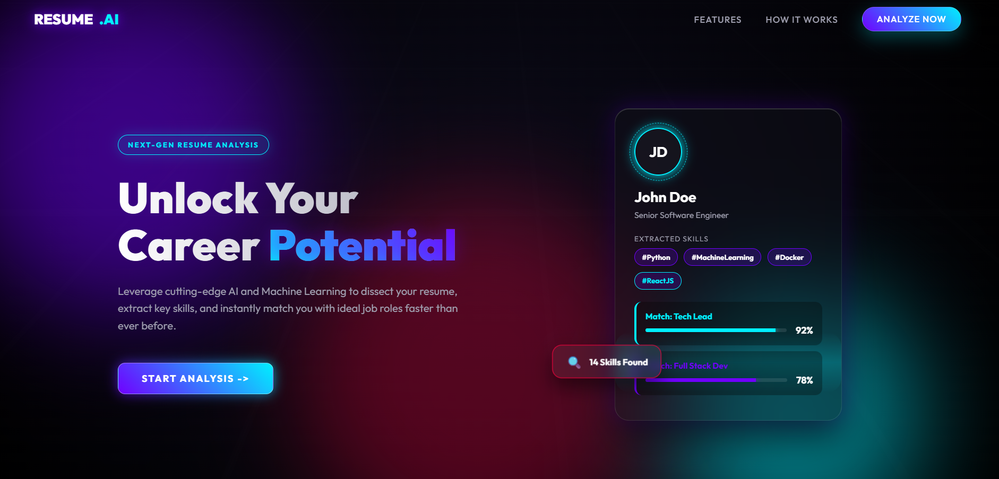
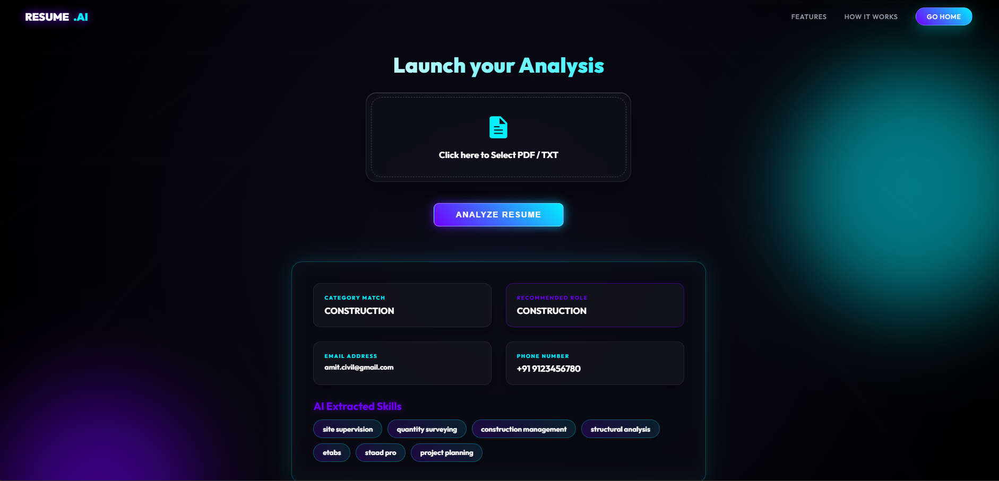

# 🧠 AI Resume Analyzer

## 📌 Overview

The **AI Resume Analyzer** is a web-based application that analyzes resumes using Machine Learning. It extracts key information like skills, phone number, email, and predicts job category along with job recommendations.

---

## 🚀 Features

* 📄 Upload Resume (PDF / TXT)
* 🤖 Predict Resume Category using ML
* 💼 Job Recommendation System
* 📱 Extract Phone Number
* 📧 Extract Email Address
* 🧠 Extract Skills from Resume
* ⚡ Fast and Simple UI

---

## 🛠️ Tech Stack

* **Frontend:** HTML, CSS
* **Backend:** Python (Flask)
* **Machine Learning:** Scikit-learn (SVM, TF-IDF)
* **Libraries:** PyPDF2, Regex

---

## 📂 Project Structure

```
resume-analyzer/
│── app.py
│── requirements.txt
│── Procfile
│── README.md
│── .gitignore
│
├── models/
│   ├── svm_classifier.pkl
│   ├── tfidf_vectorizer.pkl
│   ├── job_recoment_svm.pkl
│   └── job_recoment_tfidf.pkl
│
├── templates/
│   ├── home.html
│   ├── resume.html
│   ├── features.html
│   └── how_it_works.html
│
├── static/
```

---

## ⚙️ Installation & Setup

### 1️⃣ Clone the repository

```bash
git clone https://github.com/DeepikaGoswami1/RESUME_ANALIZER.git
cd resume-analyzer
```

### 2️⃣ Create virtual environment

```bash
python -m venv venv
venv\Scripts\activate
```

### 3️⃣ Install dependencies

```bash
pip install -r requirements.txt
```

### 4️⃣ Run the application

```bash
python app.py
```

### 5️⃣ Open in browser

```
http://127.0.0.1:5000/
```

---

## 🌐 Live Demo

👉 https://resume-analizer-s5kc.onrender.com

---

## 📷 Screenshots

*Add screenshots of your project UI here*

Example:




## 🧠 How It Works

1. User uploads resume (PDF/TXT)
2. Text is extracted using PyPDF2
3. Text is cleaned using regex
4. TF-IDF vectorization is applied
5. ML model predicts category & job role
6. Skills, email, and phone number are extracted

---

## 🔮 Future Improvements

* Add Resume Score System
* Add Job Matching API
* Improve UI/UX
* Add more accurate ML models

---

## 👨‍💻 Author

**Deepika Goswami**

---

## ⭐ Contributing

Contributions are welcome! Feel free to fork and improve this project.

---

## 📜 License

This project is open-source and available under the MIT License.
